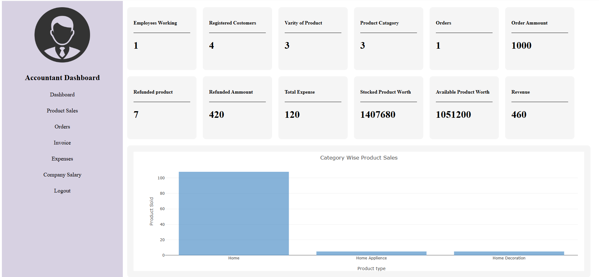
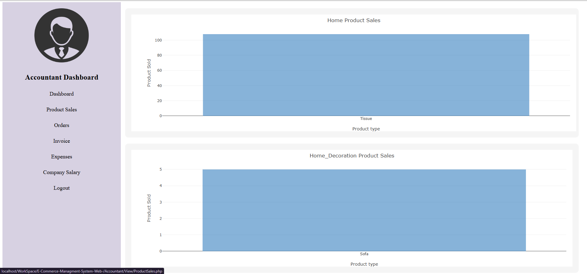
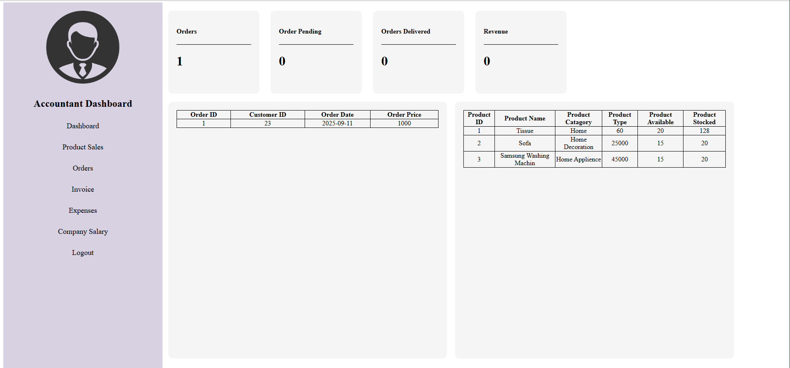
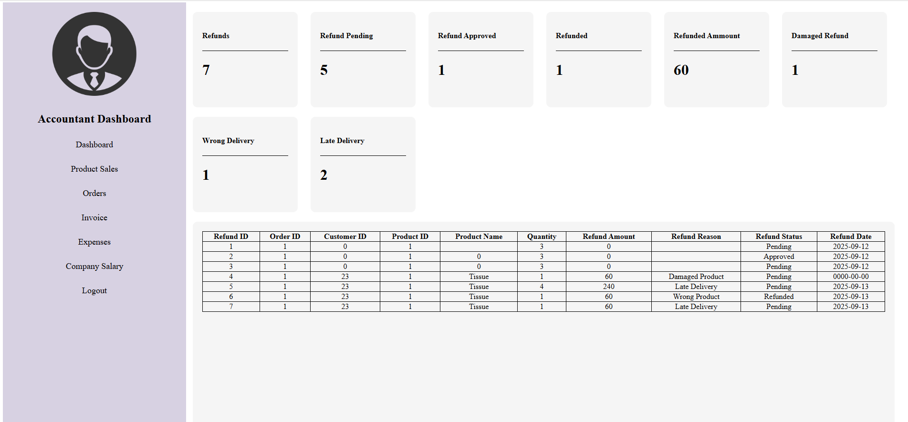
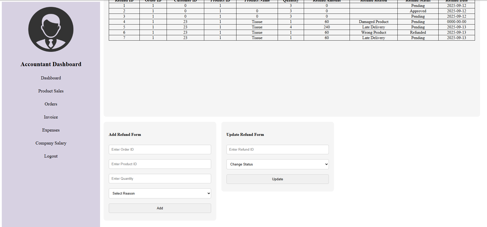
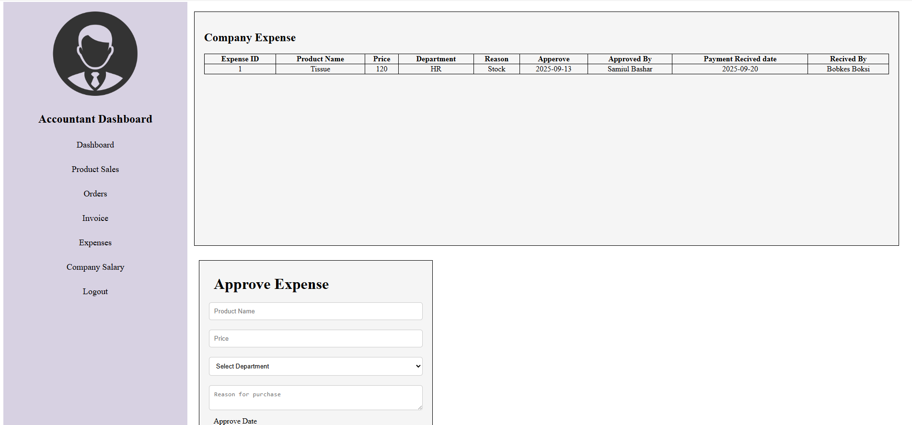
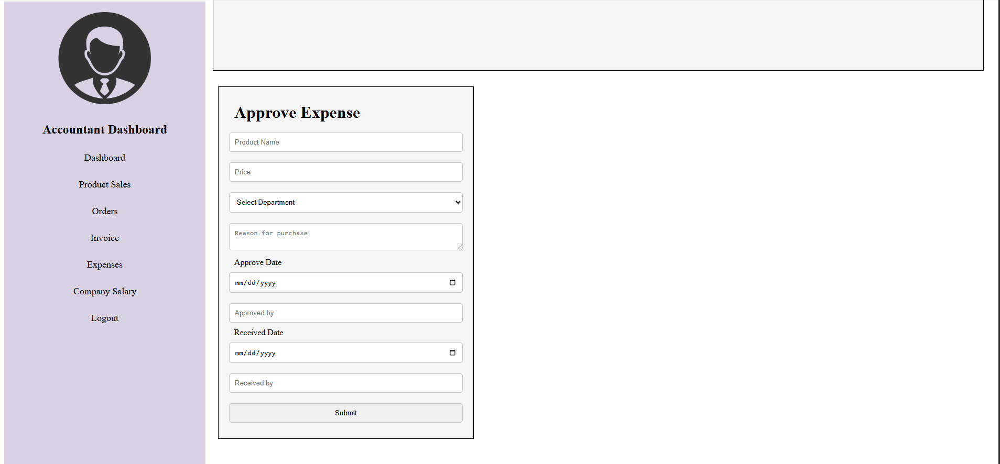
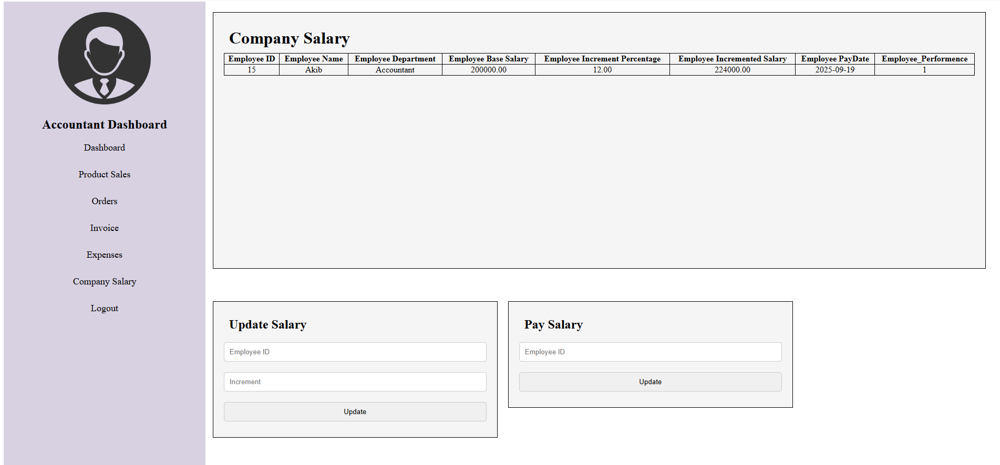
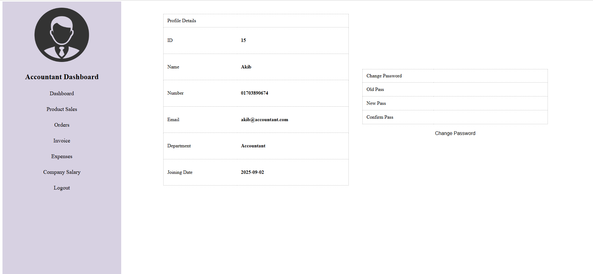

# 🛒 E-Commerce Management & Accountant Portal

---
<div align="center">

<!-- 🔹 Project Screenshots (Auto Adjustable) -->



<br/>







</div>

---

## 📌 Project Overview  
This repository contains the codebase for an **E-Commerce Management & Accountant Portal**.  
The portal is designed to help businesses manage their **online sales, accounting, and administrative operations** through a unified dashboard.

Key Features include:  
- Secure login and authentication (`Login.php`)  
- Accountant-specific financial module (under `Accountant/`)  
- Database schema (`e-commerce-managment-db.sql`) for structured data management  
- Responsive design using **HTML, CSS, JavaScript, and PHP**  
- Modular layout ready for expansion into full business management  

---

## 🎯 Target Audience  
- Small/medium-sized e-commerce merchants  
- Accountants managing online transactions  
- Developers seeking a starter project combining e-commerce & accounting logic  

---

## 🧱 Architecture & Tech Stack  
| Layer | Technology |
|-------|-------------|
| Frontend | HTML, CSS, JavaScript |
| Backend | PHP |
| Database | MySQL |
| Server | Apache / XAMPP / WAMP |
| Structure | Monolithic (refactorable to MVC) |

**Future Improvements:** 
- MVC pattern adoption  
- Secure authentication & validation modules  
- Modular architecture for easier maintenance  

---

## ✅ Highlights  
✔️ Simple and clear project structure  
✔️ SQL dump provided for setup  
✔️ Combines e-commerce and accounting logic  
✔️ Easily deployable on PHP hosting environments  

---

## ⚠️ Recommendations  
- **Security**: Add `password_hash()` for passwords, CSRF tokens, and validation  
- **Modularity**: Split files by features (User, Product, Orders, Accounting)  
- **Scalability**: Use REST APIs and asynchronous operations for reporting  
- **Testing**: Integrate PHPUnit for back-end testing  
- **Documentation**: Add a system architecture diagram and API endpoints  

---

## 🚀 Setup & Installation  

1. Clone the repository  
   ```bash
   git clone https://github.com/AkibAshfaq/E-Commarce-Managment-Accountant-Portal.git
